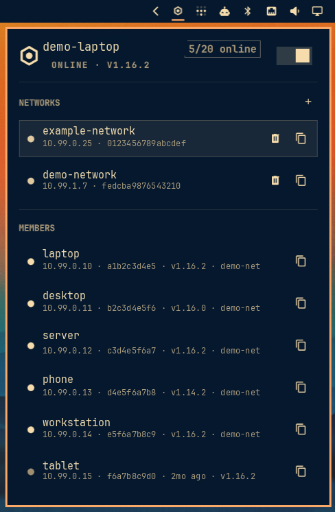

# ZeroTier — Omarchy bar widget

A bar widget for [ZeroTier](https://www.zerotier.com/), styled after the
first-party Tailscale pane in the Omarchy shell.



- **Plugin id:** `io.github.michallote.zerotier`
- **Kind:** `bar-widget`
- **License:** MIT

## Features

- **Bar icon** — a hexagon ZeroTier mark; crossed when the `zerotier-one`
  service is stopped, with a `!` badge when the node is offline or the local
  API token is unreadable.
- **Left click** opens a keyboard-friendly panel · **right click** starts /
  stops the `zerotier-one` service (via `pkexec`) · **middle click** refreshes.
- **Hero** — this node's ZeroTier Central name (matched by node address once
  the member list loads, raw address as fallback), online state, client
  version, and an `N/M online` members pill.
- **Networks** — every joined network with its status, managed ZeroTier
  IPv4/IPv6 address, and network ID. Each row has a copy button (network ID,
  name, each assigned IP) and a leave button. The `+` on the section header
  reveals a field to join a network by its 16-hex ID.
- **Members** (needs a ZeroTier Central API token) — every member of your
  joined networks the way the web console shows them: friendly name, managed
  ZeroTier IP, online dot, last-seen, client version, and an "unauthorized"
  marker. Copy button offers the name, each ZeroTier IP, the node ID and the
  last-known physical address.
- **Peers** (fallback, shown only when no Central token is set) — LEAF peers
  the local daemon knows: direct/relayed, physical endpoint, latency, version.
- Transient `zerotier-cli` hiccups are absorbed — the panel keeps the last good
  snapshot instead of flashing an error.

## Keyboard shortcuts (inside the panel)

| Key | Action |
| --- | --- |
| `j` / `k` or arrows | move cursor |
| `enter` / `space` | activate row (opens the copy menu on a network/member/peer) |
| `c` | copy the selected row's primary IP / endpoint |
| `t` | start / stop the ZeroTier service |
| `r` | refresh |
| `esc` | close |

## Requirements / dependencies

| Tool | Used for | Package (Arch) |
| --- | --- | --- |
| `zerotier-cli` | node status, networks, peers, join/leave | `zerotier-one` |
| `wl-copy` | copy-to-clipboard actions | `wl-clipboard` |
| `curl` | ZeroTier Central member list | `curl` |
| `pkexec` | one-time token setup, service start/stop | `polkit` |
| `systemctl` | service start/stop | `systemd` |

All of these ship with a default Omarchy install except `zerotier-one`
(`omarchy pkg add zerotier-one`, then `sudo systemctl enable --now
zerotier-one`).

## Install

```bash
omarchy plugin add https://github.com/Michallote/omarchy-zerotier-plugin.git --enable
omarchy bar move io.github.michallote.zerotier --section right
```

Or clone it manually into
`~/.config/omarchy/plugins/io.github.michallote.zerotier/` and run
`omarchy plugin enable io.github.michallote.zerotier right`.

### First run — grant local API access

ZeroTier keeps its local API token at `/var/lib/zerotier-one/authtoken.secret`,
root-only. **Open the panel and toggle ZeroTier on** (or click "Authorize
ZeroTier access"). That runs one `pkexec` step which copies the token and port
file into `~/.config/zerotier/`, hands the directory to your user, and starts
the service. The widget then runs `zerotier-cli -D ~/.config/zerotier …` with
no further privileges. Re-run the same toggle after a ZeroTier reinstall if the
panel ever shows "Auth token not readable".

The destination is always `~/.config/zerotier` (resolved from the invoking
user's account entry inside the privileged step) — it is intentionally not
configurable, so no setting can redirect where the privileged copy writes.

### Members list — ZeroTier Central API token

The local daemon does not know other members' names or ZeroTier IPs. Create a
read token at [my.zerotier.com](https://my.zerotier.com) → **Account → API
Access → New Token** and **paste it into the field in the panel's Members
section** — the widget writes `~/.config/zerotier/central-token` (mode 600).
A legacy `apiToken` plugin setting is still honored as a fallback if present
(the file wins), but new tokens should be pasted into the panel.

## Uninstall

```bash
omarchy plugin disable io.github.michallote.zerotier   # remove from the bar
omarchy plugin remove io.github.michallote.zerotier    # delete the plugin
```

To also remove the local state this plugin created:

```bash
rm -rf ~/.config/zerotier            # token copy, port file, central-token
```

The plugin only writes inside `~/.config/zerotier/`. It changes the bar layout
in `~/.config/omarchy/shell.json` solely through the `omarchy plugin` /
`omarchy bar` commands you run yourself, and it never modifies the system
`/var/lib/zerotier-one/` directory (it reads the auth token once, during the
`pkexec` setup you approve).

## Settings

| Key | Default | Meaning |
| --- | --- | --- |
| `refreshIntervalSec` | `30` | how often the widget polls `zerotier-cli` |

## Security notes

- The `pkexec` setup step runs a constant script: the target user/home are
  derived from `PKEXEC_UID` via the account database (never from plugin
  settings or `$USER`/`$HOME`), the destination is fixed to
  `~/.config/zerotier`, symlinks and non-directory path components are
  refused, files are staged with `mktemp` and installed with `mv -T`, and
  ownership is set per file (no recursive `chown`).
- The Central API token never appears in process arguments: it is piped over
  stdin to a helper that keeps it in a mode-0600 curl config file which curl
  reads directly, and the saved token file is mode 600.
- Central responses are capped at 1 MiB (`--max-filesize` plus a length check
  before JSON parsing).
